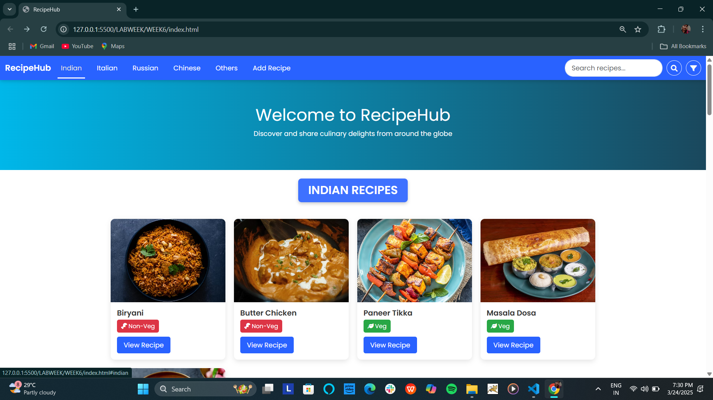
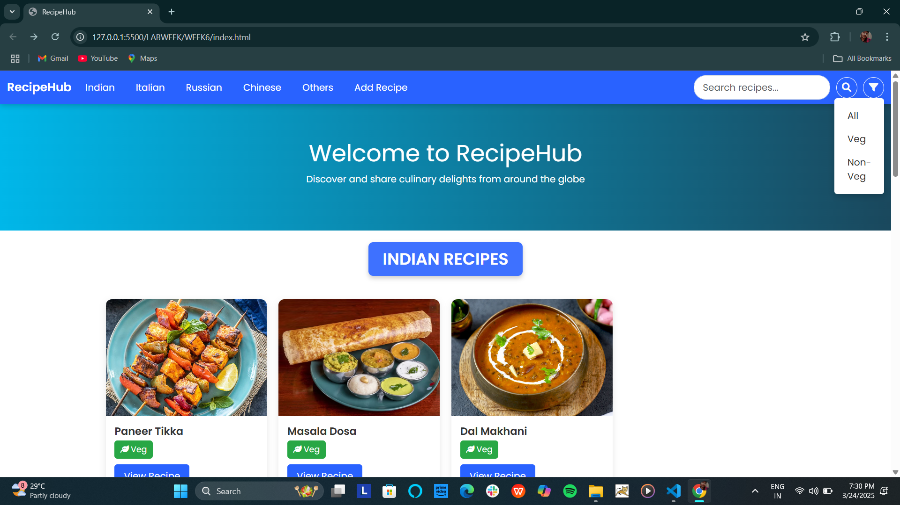
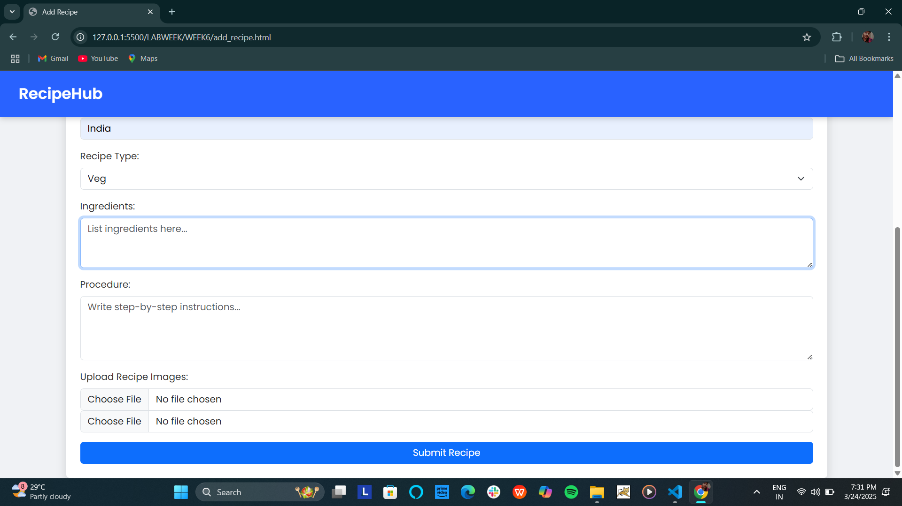
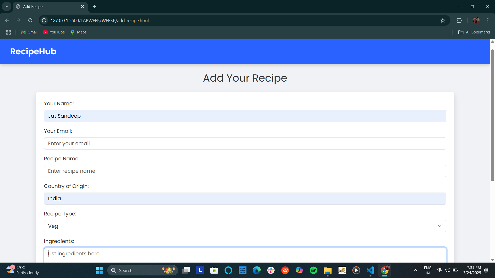
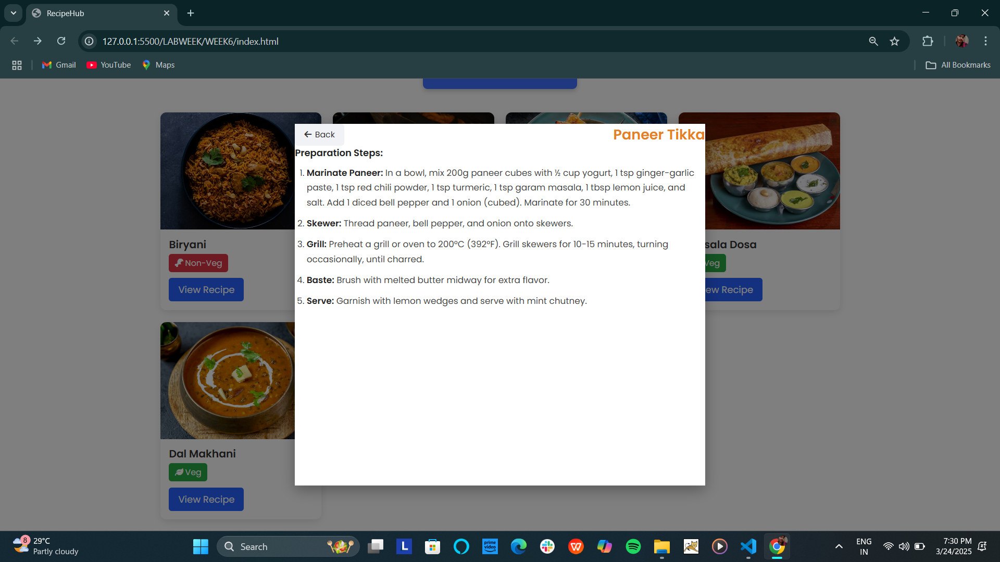
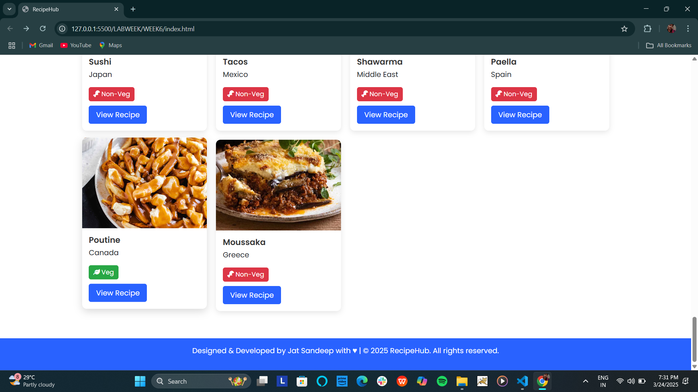

# RecipeHub

**RecipeHub** is a beautifully designed and user-friendly recipe website where users can discover, explore, and share a variety of recipes from diverse cuisines worldwide. Built using HTML, CSS, JavaScript, and Bootstrap, it delivers a seamless and interactive experience.

## Features

- **🔎 Search & Filter:** Instantly search and filter recipes by category (Veg & Non-Veg).
- **📚 Predefined Recipes:** Includes at least five curated recipes per category from Indian, Italian, Russian, Chinese, and other global cuisines.
- **📝 Add Recipe:** Users can submit their own recipes via a structured form with image upload functionality.
- **🎭 Interactive UI:** Hover effects reveal recipe details, and full procedures are displayed in elegant modals.
- **🎨 Responsive Design:** Built with Bootstrap for a fully responsive and visually appealing layout.
- **🎬 Dynamic Interactions:** JavaScript-powered interactions enhance usability.
- **🔗 Seamless Navigation:** Ensures smooth, single-page navigation for an intuitive browsing experience.

## Project Structure

```
RecipeHub/
├── index.html         # Main page displaying categorized recipes
├── add_recipe.html    # Form page for user recipe submissions
├── style.css         # CSS for styling and responsiveness
├── script.js         # JavaScript for search, filters, and modals
├── images/           # Folder for storing recipe images
```

## Technologies Used

- **HTML5** – Structured content with accessibility in mind.
- **CSS3** – Modern styling with hover effects and smooth transitions.
- **JavaScript** – Implements search, filtering, and modal interactions.
- **Bootstrap 5** – Ensures a responsive and interactive UI.
- **Font Awesome** – Enhances UI with intuitive icons.


## Screenshots

### Homepage


### Filter Feature


### Add Recipe Form - Step 1


### Add Recipe Form - Step 2


### Recipe Modal View


### Footer



## How to Use

1. **Browse Recipes** – Explore various categories.
2. **Search & Filter** – Find specific recipes using the search bar or filters.
3. **View Recipe Details** – Click "View Recipe" to see the complete cooking procedure.
4. **Submit a Recipe** – Use the "Add Recipe" form to contribute your favorite dish.

## Setup Instructions

1. Clone the repository:
   ```sh
   git clone https://github.com/JAT-SANDEEP8117/recipe_hub.git
   ```
2. Open `index.html` in a web browser to start exploring recipes.

## Contributing

We welcome contributions! Feel free to submit pull requests for UI enhancements, additional recipes, or new features.

## License

This project is licensed under the **MIT License**.

